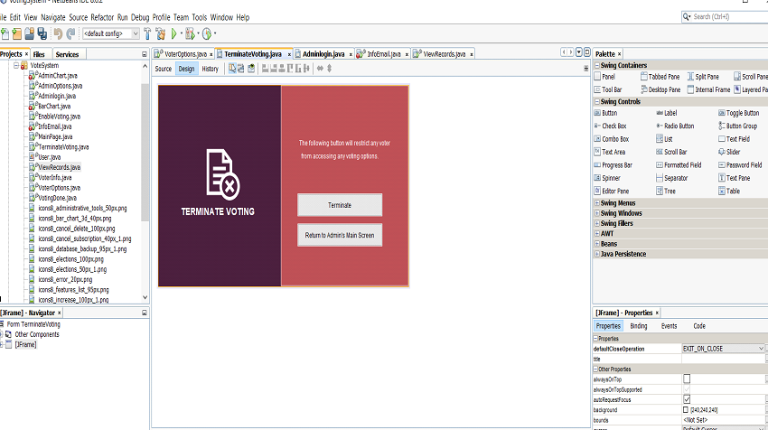
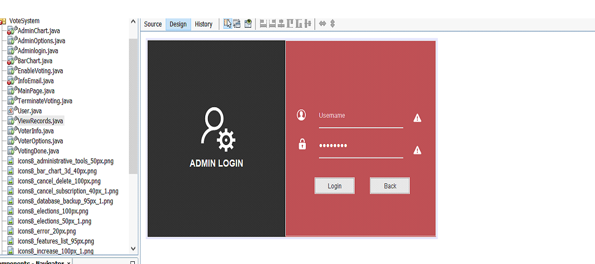
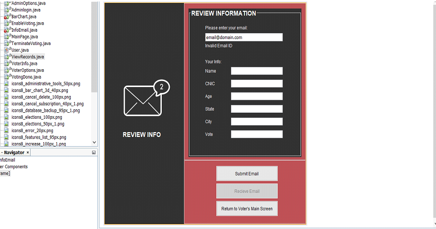
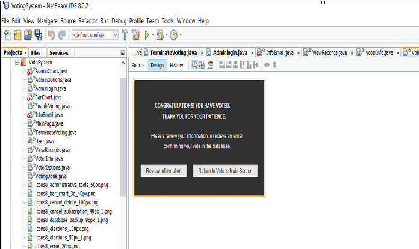

# Voting System

### Introduction:
The project we decided to embark on and create was an Online Voting System. It expands into two sections, one which is specifically for Voters while the other is dedicated for Admins. In addition to this, each of these sections expand into more options and features, set with their own guidelines for security and access. The following report will examine both sections with a comprehensive view of their working and examine their results and outcomes. 

## Resources used:

 * NetBeans IDE 8.0 / Java 
* MySQL Database/Server 8.0.24
* Smtp2go Server 
* Pichon app

  

## Working

### Admin Section
The admin section first displays a Login Panel. This feature only has a login button and requires the user to input the details of their account, which are originally stored in the database. The absence of a Sign Up button restricts voters from creating their own accounts and accessing sensitive information. Once the login information has been matched correctly, a window displaying admin options. The options include Show Statistics, View Records, Terminate/Enable voting. These options are strictly for Admin use and thus is the reason why they are limited within a private area which can only be accessed if someone has the correct credentials. Moving on, the function view records makes use of a JTable and uses the MySQL database to retrieve the information given in the table about the voter. Whereas, the bar chart uses JFreeChart to dynamically manage and display the data in order to show statistics with concern to the parties given. Last but not least, the terminate/enable voting allow the admin to put a halt on any further voting or allow it. 

## Screenshots

### Voters Section
The voter section is far more complexed than the admin one. Its features are advanced and efficient. However, unlike the admin section, the voter section does not require the user to enter any login information but rather gives them options to choose from. Show stats is one of those options, where users can view statistics in regard to the voting panel. The next option is the Proceed to vote option, which is the basic fundamental of the voting system. The user is first asked to insert their personal information as well as cast their vote. With respect to this process, if they have filled each text field correctly and according to the criteria set, then their vote will be submitted. Once a vote has been submitted, users have to reenter their information if they wish to preview it and can also receive that information through an email. 

## Screenshots

### The projects connection to information security:
In the project, we aimed to use safe and secure environments, hence the following:
*	We used the MySQL database which makes use of TLS, this ensures that there is end to end encryption between server and client and the data bieng transferred from one end to another is safe and usable. 
*	That bieng said, we also used the smtp2go server to transfer our emails from application to individual voters. Within this code, we established a TLS and SSL connection. Hence this ensured that the data bieng transferred from our application over the unsafe terminal was guarded and encrypted. 
*	Last but not least, to ensure that the sensitive data in our database stayed safe and away from potential hackers, we encrypted our passwords using the AES algorithm before saving them in the database. Furthermore, we also decrypted them once they were being used such as for login purposes. 

### Added features
*	The CNIC and email was taking as a unique data entry so no voter could vote twice using the same CNIC or email
*	The passwords in the admin database were encrypted using “aes_encrypt ()” so they would seem undecipherable to any hacker 
*	The email sent was supported by a smpt2go server and a TSL connection
*	Passwords are authenticated in email

  ## Contributors

- [Rohat Iftikhar](https://github.com/Alwaz)
- [Alwaz Qazi](https://github.com/hrhm47)
- [Muntaha Memon](https://github.com/Marwa-Khan)
- [Unsa Memon](https://github.com/mudasser-2772)

